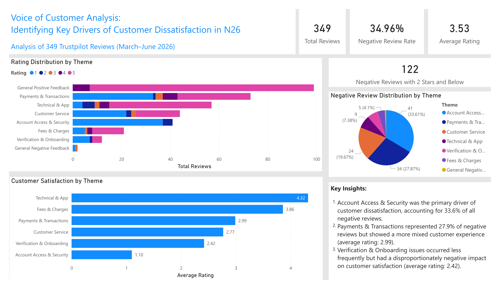

# Customer Insights Analysis | Voice of Customer Project

## Project Description

This project analyzes **349 publicly available Trustpilot reviews** of N26 collected between **March and June 2026**.

Using a **Voice of Customer (VoC)** approach, the analysis identifies the key drivers of customer dissatisfaction through review ratings, thematic categorization, SQL analysis, and Power BI visualization.

The project focuses on understanding customer pain points, complaint patterns, and customer experience issues across different stages of the customer journey.

---

## Key Skills Demonstrated

- Customer Insights Analysis
- Voice of Customer (VoC) Analysis
- Customer Experience Analytics
- SQL Data Analysis
- Power Query Data Transformation
- Power BI Dashboard Development
- Business Insight Generation

---

## Dashboard Overview

---

## Dashboard Structure

- **KPI Overview**
- **Rating Distribution by Theme**
- **Negative Review Distribution**
- **Customer Satisfaction by Theme**
- **Key Insights**

---

## Key Findings

- **Account Access & Security** was the primary driver of customer dissatisfaction, accounting for **33.6% of all negative reviews** and receiving the **lowest average rating (1.10)**.

- **Payments & Transactions** represented **27.9% of negative reviews** and showed a mixed customer experience, with an average rating of **2.99**.

- **Customer Service** accounted for **19.7% of negative reviews**, highlighting support quality and response time as recurring pain points.

- **Verification & Onboarding** occurred less frequently but had a disproportionate impact on satisfaction, receiving an average rating of **2.42**.

---

## Actionable Insights

- Prioritize improvements in account access and security processes to reduce the most critical source of customer dissatisfaction.

- Review payment and transaction workflows to improve consistency and reduce recurring customer complaints.

- Simplify onboarding and verification procedures to minimize friction during the customer acquisition journey.

- Strengthen customer support responsiveness for issues related to account access and transaction management.

---

## Features / Highlights

- Customer review categorization into customer experience themes
- SQL-based analysis of ratings, review trends, and complaint distribution
- Negative review analysis (Rating ≤ 2)
- Theme-level customer satisfaction analysis
- KPI reporting for customer experience monitoring
- Interactive Power BI dashboard design
- Business insight generation based on customer feedback data

---

## Data Source

- Trustpilot Public Reviews (March–June 2026)
- Four records with missing review dates were removed during data cleaning, resulting in a final dataset of **349 publicly available customer reviews** used for analysis.

To protect user privacy, only an anonymized sample dataset is included in this repository.

---

## Data Preparation

- Extracted numerical ratings from raw review data
- Converted relative timestamps (e.g. "3 days ago", "5 hours ago") into calendar dates using Power Query
- Standardized review date formats
- Removed records with missing review dates (4 records)
- Categorized reviews into customer experience themes
- Exported cleaned data as CSV for SQL analysis in SQLite
- Created Power BI dashboard for visualization and reporting

---

## Tech Stack

- Power BI Desktop
- Power Query
- SQLite
- SQL
- Excel / CSV
- GitHub

---

## Contact

GitHub: [GitHubProfile](https://github.com/yimengqi0826)
Email: yimengqi99@gmail.com
